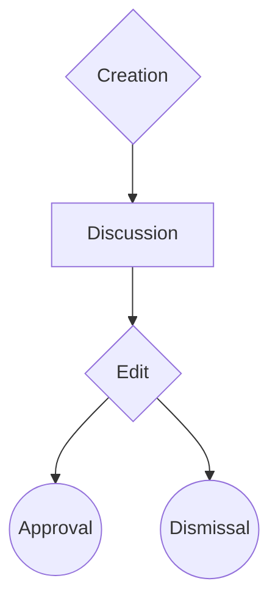

# Welcome
Thank you for helping.

## Requirements
- github account

## How to edit
1. Create a fork
2. Edit the file of the article
3. Create a Pull Request

## How to add an article
1. Create a fork
2. Create a file at an appropriate path at `/docs`
3. Add images if possible
4. Create a Pull Request

## Found an error
- Fix it by following the steps in "How to edit"
- OR: Create an [issue](https://github.com/Bloodmallet/wowtc/issues/new)

## How to write
We're using [Markdown](https://guides.github.com/features/mastering-markdown/). Check out the link to get started on how to use it.

Additionally [mkdocs-material](https://squidfunk.github.io/mkdocs-material/reference/) features are enabled. This adds some additional functionalities like 

$$
\operatorname{ker} f=\{g\in G:f(g)=e_{H}\}{\mbox{.}}
$$

See [MathJax](https://www.mathjax.org/) documentation for more details on how to write formulas.

## Advanced writing information
- Publishing library: [mkdocs](https://www.mkdocs.org/) ([Documentation](https://www.mkdocs.org/user-guide/writing-your-docs/))
- Theme: [mkdocs-material](https://squidfunk.github.io/mkdocs-material/) ([Documentation](https://squidfunk.github.io/mkdocs-material/customization/))

## Review process
After you've created a Pull Requests `approved contributors` will review your proposed change.
Please be patient. 
If you already know fitting `approved contributors` for your topic feel free to @ them in your Pull Request.

Flow:

In its shortest form a review results in the approval or dismissal of the proposed change.

## Organizational structure
## Overview
- Administrators
- Approved contributors

### Administrators
Permissions:

- invite people to be `approved contributors`
- access to limited resources e.g. domain account will be handled individually - not all administrators have access to everything
- see permissions of `approved contributors`

### Approved contributors
An `approved contributor` has access to the [repository](https://github.com/Bloodmallet/wowtc).
Following the described Review process is recommended.

Permissions:

- create branches/files
- edit files
- approve and merge pull requests
